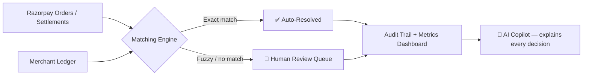

<div align="center">

# 🧾 ReconAgent
### AI Finance Controller — Explainable Reconciliation. Zero Autonomous Money Movement.

[](https://nextjs.org/)
[](#-tech-stack)
[](./LICENSE)
[](#)
[](https://your-deploy-link.vercel.app/)

<br/>

> **Razorpay AI Buildathon 2026 · Track 04 — AI Finance Controller**

**Point it at a Razorpay settlement batch and a merchant ledger. Get the truth.**
*A rule-based, explainable AI controller that auto-resolves only safe exact matches and routes everything else to a human — with a full audit trail.*

<br/>

[](https://your-deploy-link.vercel.app/)
[](#)

</div>

---

## 🧩 How it works



## ✨ What it does

- Reconciles a batch of Razorpay records against ledger entries
- Auto-resolves only exact receipt + amount + date matches
- Flags fee/amount mismatches, settlement-date offsets, and missing ledger entries
- Assigns a confidence score + plain-language explanation to every record
- Never forces a match — low-confidence items stay visible for review
- Live dashboard: throughput, exact-match rate, exception count, match-quality radar chart
- **AI Copilot** (Gemini via Google AI Studio) answers natural-language questions like *"why was recon-demo-007 escalated?"*

## 🛡️ AI Guardrails

| Guardrail | Detail |
|---|---|
| No autonomous money movement | Engine never edits the ledger, creates payments, or issues refunds |
| Human-in-the-loop | Only 100%-confidence exact matches auto-resolve; everything else needs sign-off |
| Explainable, not a black box | Every decision carries a rule-based reason + confidence score, auditable end-to-end |
| Copilot is read-only | The Gemini-powered Copilot explains decisions and policy — it cannot trigger actions |
| Demo data is labelled & synthetic | Dashboard metrics describe the synthetic batch, not a production accuracy claim |
| Credentials stay server-side | Razorpay Test keys are never exposed to the browser/client |

## ⚖️ Demo mode vs Razorpay Test API mode

| Mode | Data source | Use case |
|---|---|---|
| **Demo mode** | Labelled synthetic batch + synthetic ledger | Pitch/demo without exposing merchant data |
| **Razorpay Test API mode** | Orders fetched server-side from your Razorpay Test credentials | Verify the real Razorpay integration |

The ledger side stays simulated until a CSV/ledger API is connected — a reconciliation result is only meaningful once both sides are real.

## 🛠️ Tech stack

- **Frontend:** Next.js 15 · React 19 · TypeScript · Recharts (dashboard + radar chart)
- **Payments data:** Razorpay Orders API (Test Mode)
- **AI Copilot / NLP:** Google AI Studio — Gemini API, for natural-language explanations of reconciliation decisions
- **Reconciliation core:** rule-based, fully explainable matching engine (no black-box ML for the money-critical path)

## 🚀 Run locally

```bash
npm install
npm run dev
```

Open **[localhost:3000](http://localhost:3000)** — landing page. Dashboard: **[/dashboard](http://localhost:3000/dashboard)**.

## 🔑 Configure

`.env.local`:

```env
RAZORPAY_KEY_ID=rzp_test_your_key_id
RAZORPAY_KEY_SECRET=your_test_secret
GOOGLE_AI_STUDIO_API_KEY=your_gemini_api_key
```

Never commit `.env.local`. Endpoints: `/api/reconcile?source=demo` and `/api/reconcile?source=razorpay` — both fetch server-side, so keys stay private.

Optional: seed labelled Razorpay Test Mode orders with `npm run razorpay:seed` (Test Mode only; back off and retry on rate limits).

## 📁 Project structure

```text
app/
  api/reconcile/route.ts   # Demo + Razorpay Test API endpoint
  dashboard/page.tsx       # Interactive dashboard
  page.tsx                 # Landing page
lib/
  reconcile.ts             # Matching rules, confidence, explanations
  demo-data.ts             # Labelled synthetic batch + demo ledger
  razorpay.ts              # Server-side Razorpay Test API loader
  copilot.ts               # Gemini-powered explanation layer
scripts/
  seed-razorpay.ts         # Test Mode order seeding
```

## 🧮 Matching rules

1. **Exact** — receipt + amount + date all match → auto-resolved, 100% confidence
2. **Fuzzy** — within amount tolerance / 1-day window → explained, sent to review
3. **Unmatched** — no safe candidate → stays in the exception queue

## 🗺️ Roadmap

- Merchant ledger CSV upload + schema validation
- Persistent reconciliation runs + audit history
- Ground-truth eval report (precision, recall, false-match cost)
- Role-based review/approval workflow
- Cash-flow forecast + settlement Q&A via Copilot

## 🔒 Security notes

- Razorpay **Test Mode** keys only during dev/demo
- All credentials (Razorpay + Gemini) stay in server env vars, never client-side
- ReconAgent is decision-support, not an autonomous payment executor
- Human approval required before any production bookkeeping change
