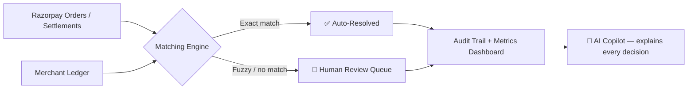
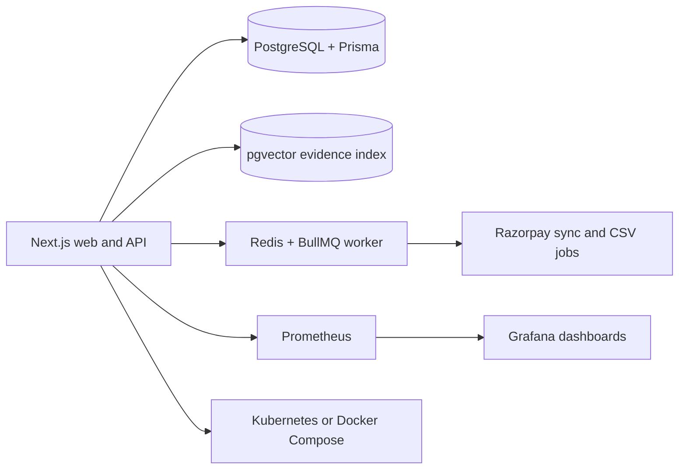

<div align="center">

# 🧾 ReconAgent
### AI Finance Controller — Explainable Reconciliation. Zero Autonomous Money Movement.

[](https://nextjs.org/)
[](#-tech-stack)
[](./LICENSE)
[](#)
[](https://reconagent-six.vercel.app/)

<br/>

> **Razorpay AI Buildathon 2026 · Track 04 — AI Finance Controller**

**Point it at a Razorpay settlement batch and a merchant ledger. Get the truth.**
*A rule-based, explainable AI controller that auto-resolves only safe exact matches and routes everything else to a human — with a full audit trail.*

<br/>

[](https://reconagent-six.vercel.app/dashboard)
[](#)

</div>

!()[https://github.com/amit-sharma-ds/ReconAgent/blob/main/Screenshots/LandingPage.png]
---

## 🧩 How it works



## ✨ What it does

- Reconciles a batch of Razorpay records against ledger entries
- Auto-resolves only exact receipt + amount + date matches
- Flags fee/amount mismatches, settlement-date offsets, and missing ledger entries
- Assigns a confidence score + plain-language explanation to every record
- Never forces a match — low-confidence items stay visible for review
- Live dashboard: throughput, exact-match rate, exception count, match-quality radar chart
- **AI Guide** uses server-side retrieval over settlement, ledger, matching-rule and audit evidence to answer natural-language questions like *"why was recon-demo-007 escalated?"*

## 🛡️ AI Guardrails

| Guardrail | Detail |
|---|---|
| No autonomous money movement | Engine never edits the ledger, creates payments, or issues refunds |
| Human-in-the-loop | Only 100%-confidence exact matches auto-resolve; everything else needs sign-off |
| Explainable, not a black box | Every decision carries a rule-based reason + confidence score, auditable end-to-end |
| Guide is read-only | Evidence retrieval explains decisions and policy — it cannot trigger actions |
| Demo data is labelled & synthetic | Dashboard metrics describe the synthetic batch, not a production accuracy claim |
| Credentials stay server-side | Razorpay Test keys are never exposed to the browser/client |

## ⚖️ Demo mode vs Razorpay Test API mode

| Mode | Data source | Use case |
|---|---|---|
| **Demo mode** | Labelled synthetic batch + synthetic ledger | Pitch/demo without exposing merchant data |
| **Razorpay Test API mode** | Orders fetched server-side from your Razorpay Test credentials | Verify the real Razorpay integration |

The ledger side stays simulated until a CSV/ledger API is connected — a reconciliation result is only meaningful once both sides are real.

## 🛠️ Tech stack

### Implemented now

- **Frontend and backend:** Next.js 15.5 · React 19 · TypeScript · App Router API routes
- **Database:** Prisma ORM with SQLite for local/demo persistence
- **Payments data:** Razorpay Orders API in Test Mode plus signed Razorpay webhook ingestion
- **Reconciliation:** Explainable rule engine with exact, fuzzy and unmatched decisions
- **RAG-style guide:** Deterministic evidence retrieval across settlement, ledger, rules and audit trail
- **Workflow:** Ledger CSV import, persisted runs, audit history and approve/reject review actions
- **Observability:** Prometheus metrics, Grafana configuration and `/api/health` health checks
- **Security:** Server-only credentials, HMAC webhook validation, request limits and security headers
- **Deployment:** Dockerfile, Docker Compose and Kubernetes manifests

### Production architecture

For a multi-instance production deployment, replace the local SQLite adapter with managed PostgreSQL and add pgvector for semantic retrieval. Redis with BullMQ can run Razorpay syncs, large reconciliation batches and CSV processing outside the web request.



PostgreSQL, pgvector, Redis and BullMQ are the scale-out path; the current hackathon deployment intentionally uses SQLite plus the deterministic retriever so it remains easy to run.

### Cache and background jobs

The current 50-record demo does not require a cache. For production traffic, Redis can be added for:

- Short-lived caching of Razorpay API responses and repeated evidence queries
- Distributed API rate limiting across multiple app instances
- BullMQ jobs for Razorpay synchronization, large reconciliation batches and CSV processing
- Queue health and retry tracking exposed to Prometheus and Grafana

Redis is therefore an optional scale-out component, not a hidden dependency of the local demo.

## 🚀 Run locally

```bash
corepack pnpm install
$env:DATABASE_URL="file:./prisma/dev.db"
corepack pnpm db:push
corepack pnpm dev
```

Open **[localhost:3000](http://localhost:3000)** — landing page. Dashboard: **[/dashboard](http://localhost:3000/dashboard)**. The deployed dashboard is **[reconagent-six.vercel.app/dashboard](https://reconagent-six.vercel.app/dashboard)**.

## 🔑 Configure

`.env.local`:

```env
RAZORPAY_KEY_ID=rzp_test_your_key_id
RAZORPAY_KEY_SECRET=your_test_secret
RAZORPAY_WEBHOOK_SECRET=set_this_in_razorpay_dashboard
DATABASE_URL=file:./prisma/dev.db
```

Never commit `.env.local`. Endpoints: `/api/reconcile?source=demo` and `/api/reconcile?source=razorpay` — both fetch server-side, so keys stay private. Configure this webhook in Razorpay Test Mode:

```text
https://reconagent-six.vercel.app/api/webhooks/razorpay
```

Optional: seed labelled Razorpay Test Mode orders with `npm run razorpay:seed` (Test Mode only; back off and retry on rate limits).
  api/guide/route.ts       # Evidence retrieval guide endpoint
  api/ledger/route.ts      # Validated merchant ledger CSV import
  api/review/route.ts      # Human approve/reject workflow
  api/webhooks/razorpay/   # Signed Razorpay webhook receiver

## 📁 Project structure

  db.ts                   # Prisma client and persistence adapter
```text
  retrieval.ts             # RAG-style evidence retrieval
  metrics.ts               # Prometheus counters
app/
  api/reconcile/route.ts   # Demo + Razorpay Test API endpoint
prisma/schema.prisma       # Settlement, ledger, run and review models
ops/prometheus.yml         # Prometheus scrape configuration
docker-compose.yml         # App + Prometheus + Grafana local stack
k8s/                       # Kubernetes deployment and monitoring manifests
  page.tsx                 # Landing page
lib/
  reconcile.ts             # Matching rules, confidence, explanations
  demo-data.ts             # Labelled synthetic batch + demo ledger
  razorpay.ts              # Server-side Razorpay Test API loader
  copilot.ts               # Gemini-powered explanation layer
scripts/
  seed-razorpay.ts         # Test Mode order seeding
```

## 🧮 Matching rules

1. **Exact** — receipt + amount + date all match → auto-resolved, 100% confidence
2. **Fuzzy** — within amount tolerance / 1-day window → explained, sent to review
3. **Unmatched** — no safe candidate → stays in the exception queue

## 📈 Observability

Run the local monitoring stack:

```bash
docker compose up --build
```

| Service | URL |
|---|---|
| ReconAgent | `http://localhost:3000` |
| Health check | `http://localhost:3000/api/health` |
| Prometheus | `http://localhost:9090` |
| Grafana | `http://localhost:3002` |
| Metrics | `http://localhost:3000/api/metrics` |

Tracked metrics include reconciliation requests, exact matches, exceptions, guide requests and API errors. Kubernetes manifests are included for a cluster deployment; use managed PostgreSQL before scaling beyond one SQLite-backed replica.

## 🗺️ Roadmap

- Managed PostgreSQL migration with pgvector semantic evidence search
- Redis + BullMQ workers for sync, CSV and large-batch jobs
- Role-based authentication and reviewer permissions
- Ground-truth evaluation report: precision, recall and false-match cost
- Cash-flow forecast and finance Q&A over approved evidence

## 🔒 Security notes

- Razorpay **Test Mode** keys only during dev/demo
- All credentials stay in server environment variables, never client-side
- Webhook requests require a constant-time HMAC signature check
- API routes have payload limits, rate limiting and secure response headers
- ReconAgent is decision-support, not an autonomous payment executor
- Human approval required before any production bookkeeping change
